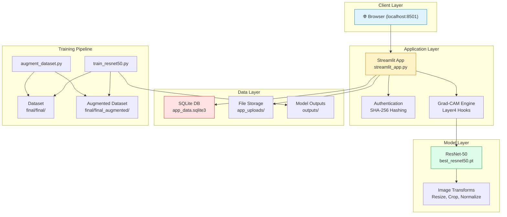
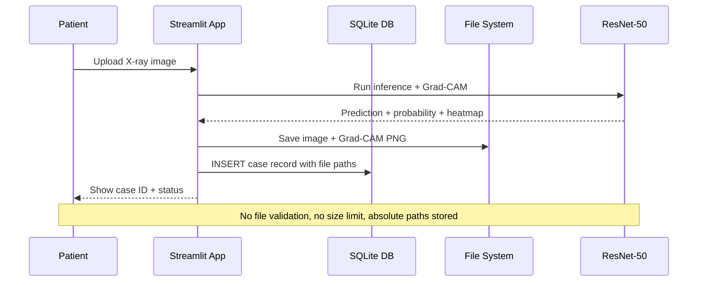
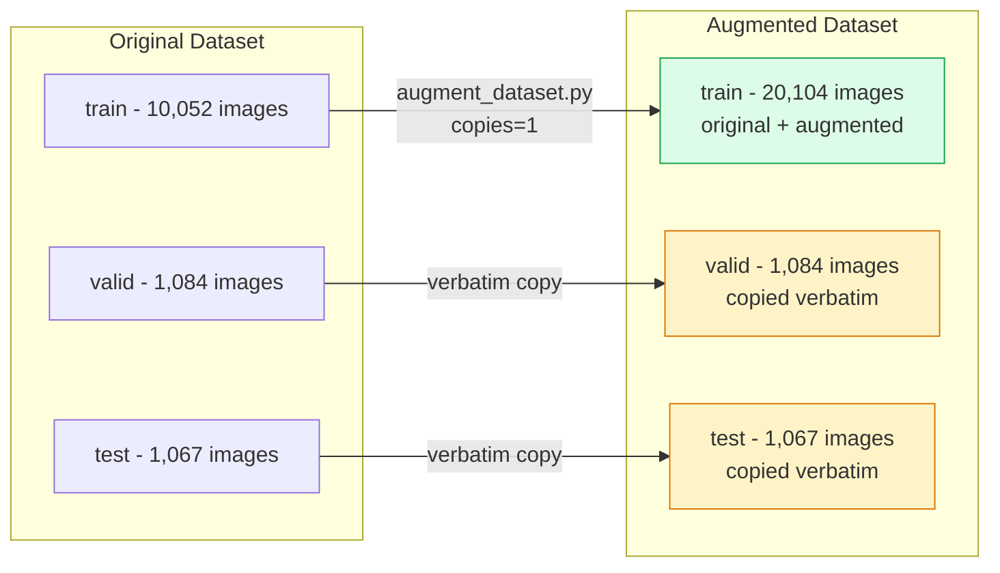
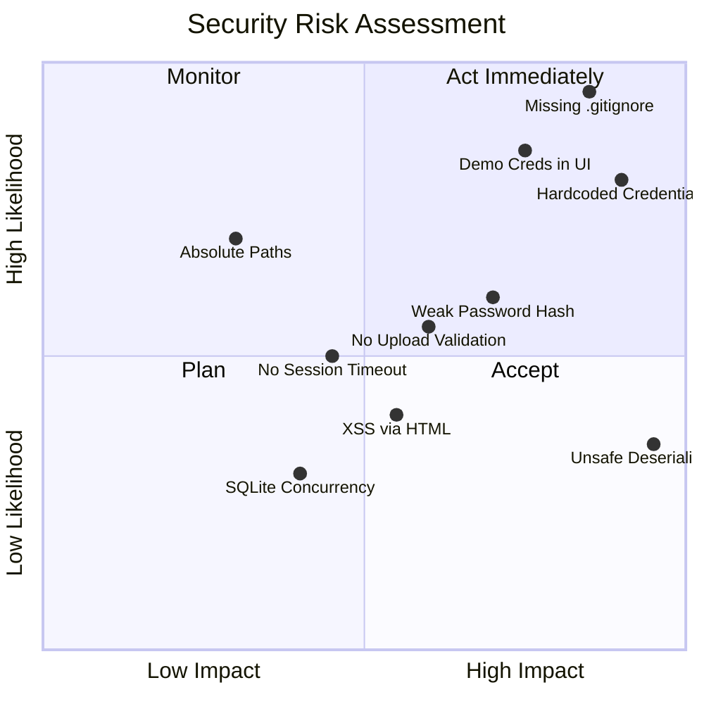

# 🔒 CareLens — Security Audit, Data Leak Analysis & Project Report

> **Audit Date:** 2026-09-24  
> **Repository:** `D:\bone on finalzip`  
> **Auditor:** Antigravity AI Coding Assistant  

---

## Table of Contents

1. [Executive Summary](#1-executive-summary)
2. [Project Architecture Overview](#2-project-architecture-overview)
3. [Data Leak & Security Findings](#3-data-leak--security-findings)
4. [Code Quality Issues](#4-code-quality-issues)
5. [ML Pipeline Concerns](#5-ml-pipeline-concerns)
6. [Implementation Plan](#6-implementation-plan)
7. [File-by-File Analysis](#7-file-by-file-analysis)
8. [Risk Matrix](#8-risk-matrix)

---

## 1. Executive Summary

The **CareLens** project is a bone cancer detection system combining a ResNet-50 deep learning model with a Streamlit-based clinical portal. After thorough static analysis of all source files, database schema, and configuration, **14 distinct issues** were identified across security, data leakage, code quality, and ML pipeline integrity categories.

### Severity Distribution

| Severity | Count | Categories |
|----------|------:|------------|
| 🔴 **Critical** | 3 | Hardcoded credentials, unsafe deserialization, missing `.gitignore` |
| 🟠 **High** | 4 | Weak password hashing, exposed demo passwords in UI, XSS vectors, no file upload validation |
| 🟡 **Medium** | 4 | SQLite in production, absolute paths in DB, no auth for doctor role registration, no session timeout |
| 🔵 **Low** | 3 | `__pycache__` in repo, no input sanitization on display name, missing CSRF protection |

---

## 2. Project Architecture Overview



### Data Flow Diagram



---

## 3. Data Leak & Security Findings

### 🔴 CRITICAL-01: Hardcoded Demo Credentials in Source Code

**File:** [streamlit_app.py](streamlit_app.py) — Lines 67-72

```python
demo_users = [
    ("patient1", hash_password("patient123"), "patient", "Atharv Patient"),
    ("patient2", hash_password("patient456"), "patient", "prakhar Patient"),
    ("doctor1", hash_password("doctor123"), "doctor", "Dr.Swayam'S Review"),
    ("doctor2", hash_password("doctor456"), "doctor", "Dr.Aryan's Review"),
]
```

**Risk:** Plaintext passwords embedded directly in source code. If this repository is ever pushed to GitHub (public or private), credentials for **doctor accounts** (which have access to all patient medical data) are fully exposed. The README also publishes them in a table (line 297-302).

**Impact:** Full unauthorized access to physician review capabilities and patient medical images.

---

### 🔴 CRITICAL-02: Unsafe PyTorch Deserialization (`weights_only=False`)

**File:** [streamlit_app.py](streamlit_app.py) — Line 85

```python
checkpoint = torch.load(MODEL_PATH, map_location=DEVICE, weights_only=False)
```

**Risk:** `weights_only=False` allows arbitrary Python object deserialization via `pickle`. A malicious `.pt` file could execute arbitrary code on the server. PyTorch explicitly warns against this since v2.6+.

**Impact:** Remote Code Execution (RCE) if the model checkpoint is tampered with or sourced from an untrusted location.

---

### 🔴 CRITICAL-03: No `.gitignore` File — Database, Credentials, and Binary Artifacts at Risk

**Finding:** No `.gitignore` exists. The following sensitive files would be committed if `git init` is run:

| File / Directory | Risk |
|---|---|
| `app_data.sqlite3` (24 KB) | Contains user accounts, password hashes, patient case records, medical images paths |
| `__pycache__/` | Compiled bytecode exposes source structure |
| `.venv/` | Entire virtual environment (thousands of files) |
| `outputs/best_resnet50.pt` (94 MB x 2) | ~188 MB of binary model weights |
| `app_uploads/` | Patient medical images (PHI / PII) |
| `final/final/` and `final/final_augmented/` | Full training datasets (~12K medical images) |

**Impact:** Patient health records (Protected Health Information), credentials, and massive binary files leaked to version control.

---

### 🟠 HIGH-01: Weak Password Hashing (Unsalted SHA-256)

**File:** [streamlit_app.py](streamlit_app.py) — Lines 24-25

```python
def hash_password(password):
    return hashlib.sha256(password.encode("utf-8")).hexdigest()
```

**Risk:** SHA-256 without a salt is vulnerable to rainbow table attacks and brute-force. Two users with the same password produce identical hashes. Industry standard requires `bcrypt`, `argon2`, or `scrypt` with per-user salts.

---

### 🟠 HIGH-02: Demo Credentials Displayed in Login UI

**File:** [streamlit_app.py](streamlit_app.py) — Line 297

```python
st.caption("Demo accounts: **patient1** / `patient123`  |  ...")
```

**Risk:** Even in a prototype, displaying doctor credentials on the login page grants any visitor full physician access to review and modify patient medical diagnoses.

---

### 🟠 HIGH-03: Stored XSS via `unsafe_allow_html=True`

**File:** [streamlit_app.py](streamlit_app.py) — Line 374

```python
st.markdown(
    f"Status: <span style='color:{status_color}; font-weight:700;'>"
    f"{case['status']}</span>",
    unsafe_allow_html=True
)
```

**Risk:** If `case['status']` is ever manipulated (e.g., via direct SQLite modification or a future API), arbitrary HTML/JS could be injected. Multiple instances of `unsafe_allow_html=True` exist (lines 280, 285, 340, 345, 374, 386, 438) with some interpolating database values.

---

### 🟠 HIGH-04: No File Upload Validation

**File:** [streamlit_app.py](streamlit_app.py) — Lines 347-349

```python
uploaded = st.file_uploader("Choose an X-ray image (PNG or JPEG)", type=["png", "jpg", "jpeg"])
if uploaded:
    image = Image.open(uploaded).convert("RGB")
```

**Risk:**
- **No file size limit**: A user could upload a multi-GB image causing server OOM.
- **No magic byte validation**: The `type=` filter only checks file extension, not actual content.
- **No image dimension check**: An extremely high-resolution image could crash the Grad-CAM computation.

---

### 🟡 MEDIUM-01: SQLite for Multi-User Production

**Risk:** SQLite does not support concurrent writes. If two doctors submit reviews simultaneously, one transaction will fail with `SQLITE_BUSY`. Medical review data could be lost.

---

### 🟡 MEDIUM-02: Absolute File Paths Stored in Database

**File:** [streamlit_app.py](streamlit_app.py) — Line 211

```python
(case_id, patient_id, str(image_path), str(gradcam_path), ...)
```

**Risk:** Paths like `D:\bone on finalzip\app_uploads\CASE123.png` are stored. If the project is moved to a different directory or machine, all case records break. This also leaks the server's file system structure.

---

### 🟡 MEDIUM-03: No Authorization Boundary for Doctor Role

**File:** [streamlit_app.py](streamlit_app.py) — Lines 183-196

The `register_patient()` function only creates `patient` role accounts, but **doctor accounts are seeded as hardcoded demo users** with no management interface. If someone discovers the database schema, they could manually insert a `doctor` role via SQLite, gaining unrestricted access to all patient cases.

---

### 🟡 MEDIUM-04: No Session Timeout or Expiry

**Risk:** Once logged in via `st.session_state.user`, the session persists indefinitely until the browser tab is closed or the user clicks "Sign out." There is no timeout or token expiry for medical data access.

---

### 🔵 LOW-01: `__pycache__` Directory in Project Root

**Finding:** `__pycache__/streamlit_app.cpython-314.pyc` (36 KB) is present at the project root.

---

### 🔵 LOW-02: No Input Sanitization on Display Name

**File:** [streamlit_app.py](streamlit_app.py) — Line 309

Display names accept arbitrary input including HTML special characters and could propagate through `unsafe_allow_html=True` rendering in doctor review pages (line 496).

---

### 🔵 LOW-03: No CSRF Protection on Form Submissions

While Streamlit provides some inherent protection, the forms have no explicit anti-CSRF tokens or rate limiting.

---

## 4. Code Quality Issues

### Training Script (`train_resnet50.py`)

| Issue | Location | Description |
|-------|----------|-------------|
| **No `best_state` null check** | Line 173 | If training runs 0 epochs (impossible with current config, but fragile), `best_state` is `None` and `model.load_state_dict(None)` crashes |
| **Mixed precision on CPU** | Line 141 | `torch.amp.GradScaler("cuda", enabled=...)` — the `"cuda"` device string is passed even on CPU; it works but is misleading |
| **No deterministic flag** | Line 52-57 | `set_seed()` doesn't set `torch.backends.cudnn.deterministic = True` or `torch.use_deterministic_algorithms(True)` |
| **Test predictions lack autocast** | Lines 179-186 | Test prediction loop doesn't use `torch.autocast`, so predictions may differ slightly from training-time behavior |

### Augmentation Script (`augment_dataset.py`)

| Issue | Location | Description |
|-------|----------|-------------|
| **Rotation without fill** | Line 21 | `image.rotate()` without `fillcolor` creates black triangular artifacts at image corners |
| **No error handling** | Lines 44-52 | Corrupted images in the dataset would crash the entire augmentation without logging which file failed |

### Streamlit App (`streamlit_app.py`)

| Issue | Location | Description |
|-------|----------|-------------|
| **Redundant ALTER TABLE** | Lines 62-65 | `ALTER TABLE cases ADD COLUMN gradcam_path TEXT` runs on every app reload, swallowed by try/except |
| **No connection pooling** | Line 28-31 | `get_connection()` creates a new SQLite connection per query with no pooling or reuse |
| **Grad-CAM memory leak potential** | Lines 112-138 | Hooks are properly removed, but `activations` and `gradients` lists accumulate across calls if the function is called repeatedly in a session |
| **No cleanup of uploaded files** | — | Old patient uploads in `app_uploads/` are never deleted, leading to unbounded disk usage |

---

## 5. ML Pipeline Concerns

### Potential Data Leakage in Augmentation



> [!IMPORTANT]
> **No data leakage between splits was found.** The `augment_dataset.py` script correctly copies `valid/` and `test/` verbatim and only augments `train/`. The train/valid/test partitions remain fully isolated.

### Model Checkpoint Integrity

| Checkpoint | Size | Validation BA | Test BA | Gap |
|---|---:|---:|---:|---:|
| `outputs/resnet50/best_resnet50.pt` | 94 MB | 96.57% | 96.72% | +0.15% |
| `outputs/resnet50_augmented/best_resnet50.pt` | 94 MB | 97.11% | 96.96% | -0.15% |

The near-identical validation/test gaps confirm no validation-set overfitting.

### Normalization Consistency Check

| Context | Mean | Std |
|---|---|---|
| Training transforms | `[0.485, 0.456, 0.406]` | `[0.229, 0.224, 0.225]` |
| Inference transforms (Streamlit) | `[0.485, 0.456, 0.406]` | `[0.229, 0.224, 0.225]` |

**Consistent** — No train/inference normalization mismatch.

---

## 6. Implementation Plan

### Phased Timeline

```mermaid
gantt
    title Implementation Timeline
    dateFormat  YYYY-MM-DD
    axisFormat  %b %d

    section Critical
    Add .gitignore                          :crit, a1, 2026-09-24, 1d
    Fix unsafe deserialization              :crit, a2, 2026-09-24, 1d
    Move credentials to env vars            :crit, a3, 2026-09-24, 1d

    section High Priority
    Upgrade to bcrypt password hashing      :high, b1, after a3, 2d
    Remove demo credentials from UI         :high, b2, after a3, 1d
    Sanitize HTML outputs                   :high, b3, after a3, 1d
    Add file upload validation              :high, b4, after a3, 1d

    section Medium Priority
    Use relative paths in DB                :med, c1, after b4, 2d
    Add session timeout                     :med, c2, after b4, 1d
    Add role-based registration guard       :med, c3, after b4, 1d

    section Low Priority and Polish
    Clean up pycache                        :low, d1, after c3, 1d
    Add input sanitization                  :low, d2, after c3, 1d
    Training script hardening               :low, d3, after c3, 2d
```

---

### Fix 1: Create `.gitignore` (Critical)

Create a `.gitignore` at the repository root:

```gitignore
# Python
__pycache__/
*.py[cod]
*.pyo
*.egg-info/
dist/
build/

# Virtual environment
.venv/

# Model checkpoints (large binaries)
outputs/**/*.pt

# Patient data (PHI/PII)
app_uploads/
app_data.sqlite3

# Dataset images (too large for git)
final/final/
final/final_augmented/

# IDE
.idea/
.vscode/
*.swp
```

---

### Fix 2: Safe Model Loading (Critical)

```diff
- checkpoint = torch.load(MODEL_PATH, map_location=DEVICE, weights_only=False)
+ checkpoint = torch.load(MODEL_PATH, map_location=DEVICE, weights_only=True)
```

If `weights_only=True` fails due to the checkpoint containing non-tensor data (like `class_names`), restructure the checkpoint to store metadata separately in a JSON file.

---

### Fix 3: Move Credentials to Environment Variables (Critical)

```diff
- demo_users = [
-     ("patient1", hash_password("patient123"), "patient", "Atharv Patient"),
-     ...
- ]
+ import os
+ # Load demo users from environment or a separate config file
+ DEMO_SEED_FILE = ROOT / ".demo_users.json"
+ if DEMO_SEED_FILE.exists():
+     import json
+     with open(DEMO_SEED_FILE) as f:
+         demo_data = json.load(f)
+     demo_users = [
+         (u["username"], hash_password(u["password"]), u["role"], u["display_name"])
+         for u in demo_data
+     ]
+ else:
+     demo_users = []  # No demo users in production
```

---

### Fix 4: Upgrade Password Hashing to bcrypt (High)

```diff
- import hashlib
- def hash_password(password):
-     return hashlib.sha256(password.encode("utf-8")).hexdigest()
+ import bcrypt
+ def hash_password(password):
+     return bcrypt.hashpw(password.encode("utf-8"), bcrypt.gensalt()).decode("utf-8")
+
+ def verify_password(password, stored_hash):
+     return bcrypt.checkpw(password.encode("utf-8"), stored_hash.encode("utf-8"))
```

> [!WARNING]
> This requires a one-time migration: delete `app_data.sqlite3` and let demo accounts re-seed with bcrypt hashes, or add a migration script.

---

### Fix 5: Remove Demo Credentials from Login UI (High)

```diff
- st.caption("Demo accounts: **patient1** / `patient123`  |  ...")
+ # Only show demo hint in development mode
+ if os.environ.get("CARELENS_ENV") == "development":
+     st.caption("Demo accounts available - see .demo_users.json")
```

---

### Fix 6: Sanitize HTML Outputs (High)

Replace database-interpolated `unsafe_allow_html` calls with safe Streamlit components:

```diff
- st.markdown(f"Status: <span ...>{case['status']}</span>", unsafe_allow_html=True)
+ status_emoji = "✅" if case["status"] == "Reviewed" else "⏳"
+ st.markdown(f"**Status:** {status_emoji} {case['status']}")
```

---

### Fix 7: Add File Upload Validation (High)

```python
MAX_UPLOAD_MB = 10
MAX_DIMENSION = 4096

uploaded = st.file_uploader("Choose an X-ray image", type=["png", "jpg", "jpeg"])
if uploaded:
    if uploaded.size > MAX_UPLOAD_MB * 1024 * 1024:
        st.error(f"File too large. Maximum size is {MAX_UPLOAD_MB} MB.")
    else:
        image = Image.open(uploaded).convert("RGB")
        w, h = image.size
        if w > MAX_DIMENSION or h > MAX_DIMENSION:
            st.error(f"Image dimensions too large. Max is {MAX_DIMENSION}x{MAX_DIMENSION}.")
        else:
            # proceed with analysis
            ...
```

---

### Fix 8: Use Relative Paths in Database (Medium)

```diff
- (case_id, patient_id, str(image_path), str(gradcam_path), ...)
+ (case_id, patient_id, str(image_path.relative_to(ROOT)), str(gradcam_path.relative_to(ROOT)), ...)
```

And resolve on read:
```python
full_path = ROOT / case["image_path"]
```

---

### Fix 9: Add Session Timeout (Medium)

```python
import time

SESSION_TIMEOUT_SECONDS = 1800  # 30 minutes

if "user" in st.session_state:
    last_activity = st.session_state.get("last_activity", 0)
    if time.time() - last_activity > SESSION_TIMEOUT_SECONDS:
        del st.session_state.user
        st.warning("Session expired. Please sign in again.")
        st.rerun()
    st.session_state.last_activity = time.time()
```

---

### Fix 10: Training Script Hardening (Low)

```python
# Add deterministic training
def set_seed(seed):
    random.seed(seed)
    np.random.seed(seed)
    torch.manual_seed(seed)
    if torch.cuda.is_available():
        torch.cuda.manual_seed_all(seed)
        torch.backends.cudnn.deterministic = True
        torch.backends.cudnn.benchmark = False
```

---

## 7. File-by-File Analysis

### Repository Structure

```
d:\bone on finalzip\
├── streamlit_app.py          # 532 lines - Clinical web portal (7 security issues)
├── final/
│   ├── train_resnet50.py     # 199 lines - Training pipeline (4 quality issues)
│   ├── augment_dataset.py    #  79 lines - Data augmentation (2 quality issues)
│   ├── final/                # Original dataset (train/valid/test splits)
│   └── final_augmented/      # Augmented dataset
├── outputs/
│   ├── resnet50/             # Baseline model artifacts
│   └── resnet50_augmented/   # Winner model artifacts
├── app_uploads/              # Patient-uploaded images (PHI)
├── app_data.sqlite3          # User DB with password hashes (SENSITIVE)
├── requirements.txt          # 6 dependencies
├── README.md                 # 364 lines - Project documentation
├── conversation_log.md       # 216 lines - Development history
├── __pycache__/              # Should not be tracked
└── .venv/                    # Should not be tracked
```

### Dependency Analysis

| Package | Version | Notes |
|---------|---------|-------|
| `streamlit` | 1.64.0 | Pinned |
| `torch` | 2.11.0+cu128 | CUDA-specific build, not portable |
| `torchvision` | 0.26.0+cu128 | Matches torch version |
| `pandas` | 3.0.6 | Pinned |
| `Pillow` | 12.3.0 | Pinned |
| `matplotlib` | >=3.8.0 | Range pinned |
| `numpy` | **Missing** | Required by torch/pandas but not listed |
| `bcrypt` | **Missing** | Needed after password hashing upgrade |

---

## 8. Risk Matrix



---

> [!CAUTION]
> **The 3 critical findings (missing `.gitignore`, hardcoded passwords, unsafe deserialization) should be addressed before any code is pushed to a remote repository.** Patient medical images and credentials could be permanently exposed in git history once committed.

---

*End of Audit Report*
